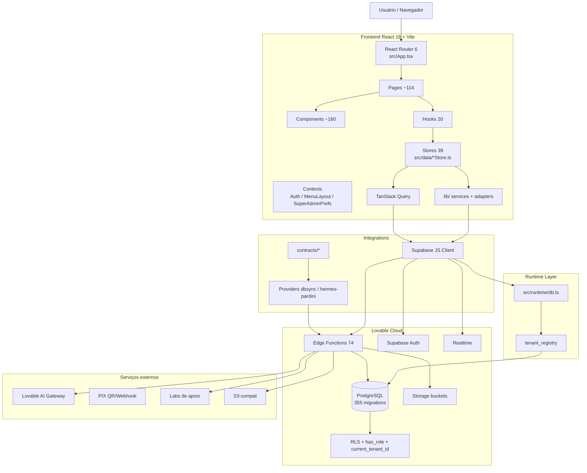
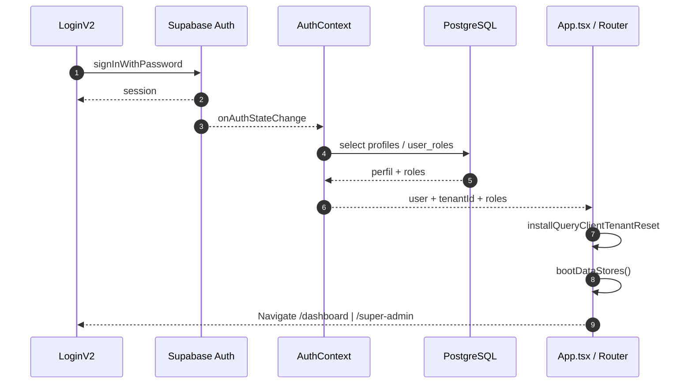
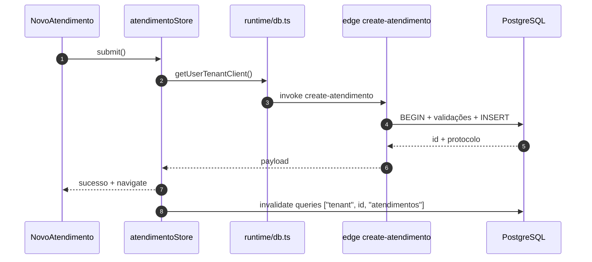
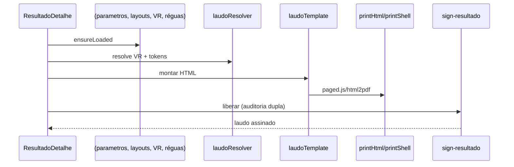
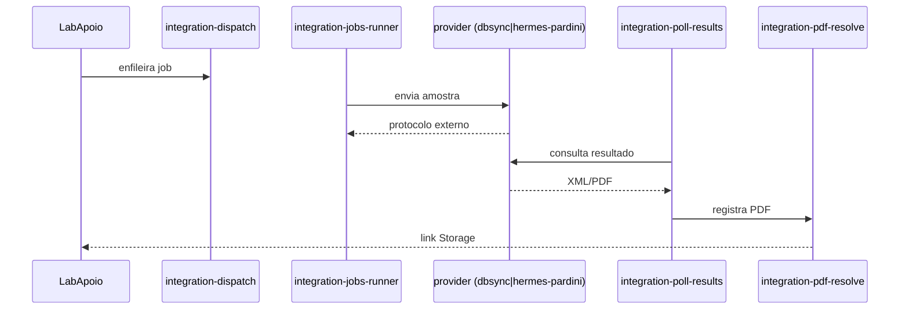
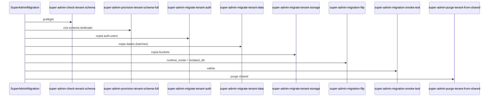

# 12 — Communication Diagrams

Diagramas refletindo o estado atual do sistema (rotas, providers, stores, edge functions e integrações efetivamente presentes).

## Diagrama macro (visão geral)

Artefato Mermaid separado (renderizável): `/mnt/documents/sislac-arch.mmd`.

## Diagrama de fluxo — Autenticação

## Diagrama de fluxo — Criação de atendimento

## Diagrama de fluxo — Resultado / Laudo

## Diagrama de fluxo — Lab de apoio

## Diagrama de fluxo — Super Admin / Migração runtime

